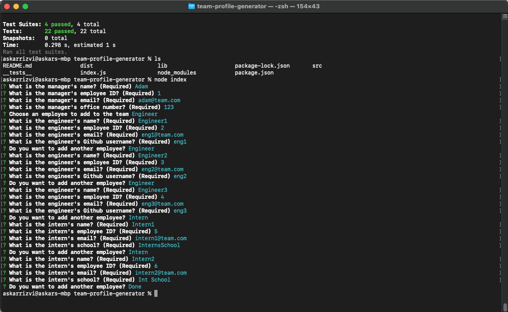
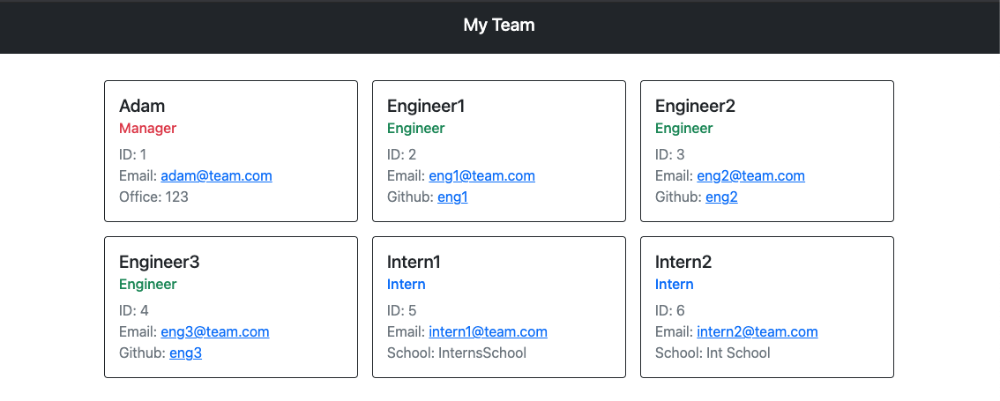

# Team Profile Generator
  

  ## Description
  Thic challenge incolves building an application that will take members of a development team as input and output an HTML file that has cards with the name of the team member, their role, their ID number, their email address and various other information depending on the team member's role. This challenge uses javascript classes, along with the inquirer module for node to survey the user, and Bootstrap is used for the styling. JEST i sused to create and run the tests.

  ## Table of Contents

* [Installation](#installation)
* [Usage](#usage)
* [Contributing](#contributing)
* [Tests](#tests)
* [Credits](#credits)
* [License](#license)
* [Questions](#questions)

## Installation
1: Clone the repository 2:  Run "npm install" to install the modules 3:  Run "node index" to run the application 4:  Run "node test" to run the JEST tests 5:  A new index.html file will be generated in the dist folder 

## Usage

## Contributing
The guidelines are based on the contributor covenant, you can find the covenant here: https://www.contributor-covenant.org/version/2/0/code_of_conduct/code_of_conduct.txt

## Tests
Run "node test" to run the JEST tests

## Credits

Readme guide: https://github.com/coding-boot-camp/potential-enigma/blob/main/readme-guide.md  
ChooseALicense: https://choosealicense.com/ 
Markdown License Badges: https://gist.github.com/lukas-h/2a5d00690736b4c3a7ba

## License
https://www.gnu.org/licenses/gpl-3.0  
Licensed under GNU GPLv3

## Questions
https://github.com/askarrizvi  
If you have any further questions, you can reach me at:  
askarrizvi88@gmail.com
